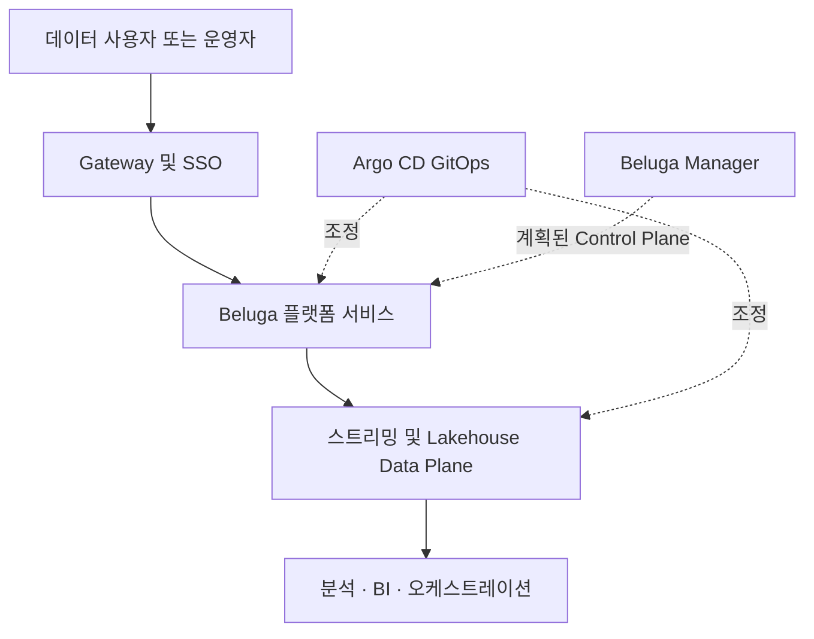
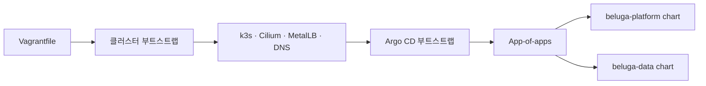

# 아키텍처 (Architecture)

[English](architecture.md) | 한국어

이 문서는 내비게이션 레벨의 아키텍처 요약이다. 근거가 되는 설계 원본은
[docs/superpowers/specs/2026-08-09-beluga-data-platform-design.md](superpowers/specs/2026-08-09-beluga-data-platform-design.md)이며,
이 문서는 OpenForge 문서 세트가 요구하는 `docs/architecture.md` 진입점을 두기 위한
것으로, 그 설계서를 중복 서술하지 않고 링크만 한다.

## 전체 구조

Beluga는 배포 가능한 데이터 플랫폼 구성을 소유합니다. 개별 OSS 서비스는 자체
상태의 authoritative source로 유지되고, Beluga가 재현 가능한 인프라, 공통 인증,
정책 및 GitOps lifecycle을 제공합니다.

## 레이어

Beluga는 전 구간 IaC다 — 어떤 것도 여기서 빌드·벤더링하지 않는다. 배포되는 모든
컴포넌트 이미지는 [VERSIONS.md](../VERSIONS.md)(버전/이미지/라이선스의 단일
원천)에 선언된 대로 배포 시점에 각자의 업스트림 레지스트리에서 그대로 받아온다.

컴포넌트별 전체 레이어 표(클러스터, 게이트웨이, GitOps, SSO/계정, 정책, 수집,
스트림 처리, 카탈로그, 스토리지, DB, 분석, BI, 오케스트레이션, 거버넌스, 관측성)는
[README-ko.md](../README-ko.md#아키텍처-한눈에-보기)를 참고한다.

## 소유권 경계

- **버전 단일 원천**: `VERSIONS.md`. 다른 곳에 버전 주장을 중복하지 않는다.
- **GitOps 소유권**: `beluga-platform`/`beluga-data` ArgoCD `Application`은
  `selfHeal: true`다 — 커밋+푸시 없는 `kubectl apply`는 자동으로 되돌려진다.
  이것이 요구하는 검증 규율은 [CLAUDE.md](../CLAUDE.md) 참고.
- **정책 소스**: `policies/*.yaml`은 companion 리포(정책 컴파일러)가
  Keycloak/Rego/PostgreSQL DDL 산출물로 컴파일하는 선언적 입력이다. 이 리포는 그
  컴파일 산출물을 직접 작성하지 않는다.
- **자격증명 경계**: 어떤 자격증명도 커밋되지 않는다 — 모든 값은 부트스트랩
  시점에 생성되어 `beluga-credentials` Kubernetes Secret에 저장된다
  ([SECURITY-ko.md](../SECURITY-ko.md) 참고).

## 결정 기록

지속적이고 범부서적인 아키텍처 결정은 [docs/adr/](adr/README-ko.md)에 ADR로
기록한다. 일상적인 운영 결함과 그 근본 원인은 별도로
[docs/mistakes-log.md](mistakes-log.md)에 기록한다 — 그 로그는 "왜 깨졌는가"를
상세히 남기는 기록이고, ADR은 "왜 이렇게 결정했는가"를 남기는 기록이다.

## 아키텍처 문서 경계

- 이 문서는 전체 구조와 소유권 경계를 보여주는 개요입니다.
- 상세 근거와 흐름은 [플랫폼 설계 원본](superpowers/specs/2026-08-09-beluga-data-platform-design.md)에 있습니다.
- Vagrant, k3s 및 GitOps 결정은 [ADR-0001](adr/0001-vagrant-k3s-gitops-platform-architecture-ko.md)에 기록합니다.
- README는 현재 구성요소 목록, `VERSIONS.md`는 버전의 단일 원천입니다.
