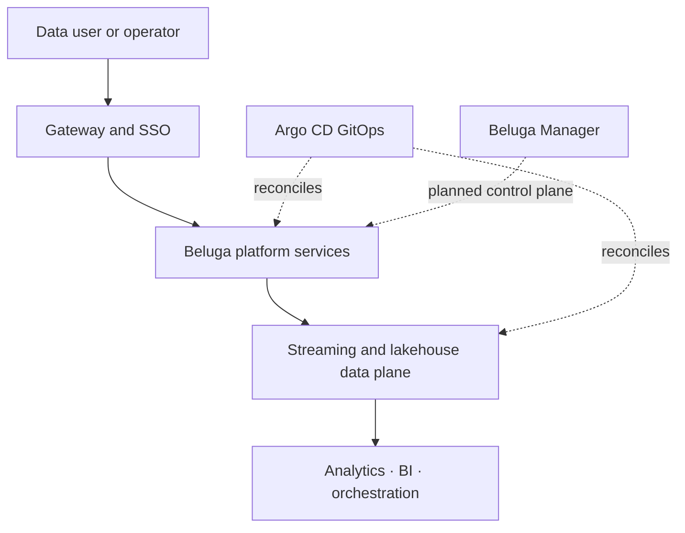
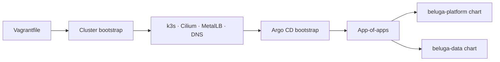

# Architecture

English | [한국어](architecture-ko.md)

This is a navigation-level architecture summary. The authoritative design record is
[docs/superpowers/specs/2026-08-09-beluga-data-platform-design.md](superpowers/specs/2026-08-09-beluga-data-platform-design.md);
this document exists so the OpenForge documentation set has a discoverable
`docs/architecture.md` entry point, and links out rather than duplicating that spec.

## System context

Beluga owns the deployable data-platform composition. Individual OSS services remain
authoritative for their native state; Beluga adds reproducible infrastructure, shared
identity, policy and GitOps lifecycle.

## Layers

Beluga is IaC end-to-end: nothing here is built or vendored. Every deployed component
image is pulled at deploy time from its own upstream registry, as declared in
[VERSIONS.md](../VERSIONS.md) (the single source of truth for versions/images/
licenses).

See [README.md](../README.md#architecture-at-a-glance) for the full per-component
layer table (cluster, gateway, GitOps, SSO/accounts, policy, ingestion, stream
processing, catalog, storage, database, analytics, BI, orchestration, governance,
observability).

## Ownership boundaries

- **Version source of truth**: `VERSIONS.md`. Do not duplicate version claims elsewhere.
- **GitOps ownership**: `beluga-platform`/`beluga-data` ArgoCD `Application`s run with
  `selfHeal: true`. A `kubectl apply` without a corresponding commit+push is reverted
  automatically — see [CLAUDE.md](../CLAUDE.md) for the verification discipline this
  implies.
- **Policy source**: `policies/*.yaml` is the declarative input a companion repo (the
  policy compiler) compiles into Keycloak/Rego/PostgreSQL DDL outputs. This repo does
  not hand-author those compiled artifacts.
- **Credential boundary**: no credential is ever committed; every value is generated at
  bootstrap into the `beluga-credentials` Kubernetes Secret (see
  [SECURITY.md](../SECURITY.md)).

## Decisions

Durable, cross-cutting architecture decisions are recorded as ADRs in
[docs/adr/](adr/README.md). Day-to-day operational failures and their root causes are
recorded separately in [docs/mistakes-log.md](mistakes-log.md) — that log is the
detailed "why did this break" record; ADRs are the "why did we choose this" record.

## Architecture views

- This page is the overview and ownership map.
- The [authoritative platform design](superpowers/specs/2026-08-09-beluga-data-platform-design.md)
  contains component-level rationale and flows.
- [ADR-0001](adr/0001-vagrant-k3s-gitops-platform-architecture.md) records the
  Vagrant, k3s and GitOps deployment decision.
- The README maintains the current component inventory; `VERSIONS.md` owns versions.
